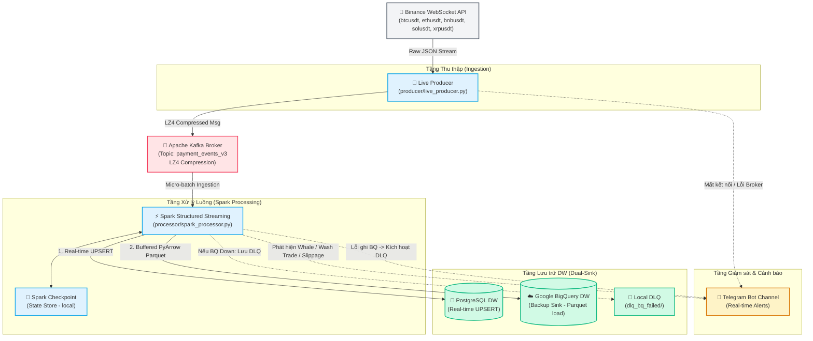
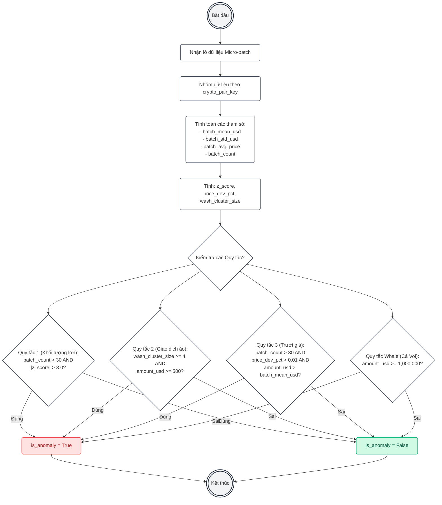
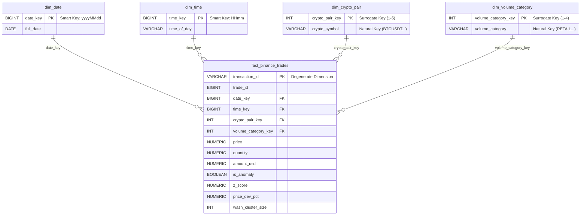

# Real-Time Crypto Data Pipeline: Binance Trade Ingestion, Anomaly Detection & Dual-Sink Data Warehouse

**🎬 Demo Video:** [https://www.youtube.com/watch?v=GCkgsPlZs2A](https://www.youtube.com/watch?v=GCkgsPlZs2A)

Hệ thống Data Pipeline xử lý luồng (streaming data pipeline) thời gian thực cho dữ liệu giao dịch tiền mã hóa (Cryptocurrency) từ sàn Binance. Dự án được thiết kế theo mô hình kho dữ liệu chuẩn **Kimball Star Schema** và tích hợp bộ xử lý trung tâm **Apache Spark Structured Streaming** cùng cơ chế giám sát cảnh báo qua **Telegram Bot**.

---

## 🏗 Kiến Trúc Hệ Thống (System Diagram)

Hệ thống được chia thành 5 tầng rõ rệt theo mô hình Lambda thu nhỏ định hướng luồng (streaming-first architecture):



---

## 📁 Cấu Trúc Dự Án (Project Directory Structure)

Mã nguồn được cấu trúc hóa theo nguyên lý phân lớp chức năng rõ rệt, cô lập logic xử lý dữ liệu với cơ sở hạ tầng:

```
├── producer/
│   ├── __init__.py
│   └── live_producer.py         # Kết nối websocket Binance, đẩy dữ liệu thô dạng Bytes/LZ4 vào Kafka.
├── processor/
│   ├── __init__.py
│   └── spark_processor.py       # Bộ xử lý trung tâm Spark Streaming (Làm sạch, Phân loại, Phát hiện bất thường & Dual-Sink).
├── warehouse/
│   ├── __init__.py
│   ├── postgres_schema.py       # Định nghĩa lược đồ Star Schema (DDL) trên PostgreSQL.
│   ├── bigquery_schema.py       # Định nghĩa lược đồ Star Schema trên Google BigQuery.
│   ├── seed_dimensions_pg.py    # Nạp dữ liệu danh mục tĩnh (dim_date, dim_time, dim_crypto_pair...) vào Postgres.
│   ├── seed_dimensions_bq.py    # Nạp dữ liệu danh mục tĩnh vào Google BigQuery.
│   └── bq_reconcile.py          # Đối soát số lượng tin nhắn giữa Kafka và Google BigQuery.
├── scripts/
│   ├── check_pg_data.py         # Truy vấn nhanh dữ liệu PostgreSQL DW phục vụ kiểm thử.
│   ├── inject_anomalies.py      # Bơm (inject) dữ liệu bất thường nhân tạo vào Kafka để test bộ lọc.
│   ├── evaluate_anomalies.py     # Đo lường và đánh giá tỷ lệ bắt chính xác bất thường thống kê.
│   ├── sensitivity_analysis.py  # Phân tích độ nhạy của tham số (Z-Score threshold, Wash trade size).
│   ├── retry_dlq_to_bq.py       # Tự động hóa quét DLQ và tải bù dữ liệu lên BigQuery (Self-Healing).
│   ├── pg_to_bq_sync.py         # Script đồng bộ dữ liệu ngoại tuyến từ PostgreSQL sang BigQuery.
│   └── hard_reset_spark.py      # Reset nhanh Spark checkpoint và bộ nhớ đệm cục bộ khi cần chạy lại.
├── Makefile                     # Quản lý tất cả các lệnh triển khai, chạy và kiểm tra hệ thống.
├── docker-compose.yml           # Triển khai môi trường ảo (Kafka, Zookeeper, PostgreSQL).
├── requirements.txt             # Định nghĩa thư viện Python của hệ thống.
└── .env                         # Tệp cấu hình các biến môi trường hệ thống.
```

---

## ⚙️ Quy Trình Xử Lý Dữ Liệu 7 Bước (7-Step Pipeline)

Toàn bộ luồng tính toán dữ liệu của **Spark Structured Streaming** (`processor/spark_processor.py`) tuân thủ nghiêm ngặt mô hình xử lý phân đoạn để tối ưu hóa bộ nhớ:

| Bước | Tác vụ | Mô tả chi tiết |
|------|-----------|-------------|
| **1** | **Type Casting** | Ép kiểu dữ liệu dạng chuỗi (String) nhận từ Binance sang kiểu số học phù hợp (Double, Long). |
| **2** | **Data Cleansing** | Loại bỏ dữ liệu nhiễu/lỗi mạng (chấp nhận giá trị `price > 0`, `quantity > 0` và không trống `Null`). |
| **3** | **Deduplication** | Kết hợp Khóa ghép tự nhiên (Natural Composite Key: `crypto_symbol` + `trade_id`) + Cơ chế cửa sổ Watermark 30 giây để lọc bỏ các giao dịch gửi trùng lắp. |
| **4** | **Transformation** | Tính toán trường thông tin phái sinh: Tổng giá trị giao dịch bằng USD ($Amount_{USD} = Price \times Quantity$). |
| **5** | **Volume Classification** | Phân hạng quy mô giao dịch theo Surrogate Key: `1=RETAIL` (<$10k), `2=PRO` ($10k-$100k), `3=INST` ($100k-$1M), `4=WHALE` ($\ge$ $1M). |
| **6** | **Anomaly Detection** | Áp dụng thống kê động qua Window Function trong hàm `foreachBatch` để đánh dấu các giao dịch bất thường (Point, Contextual, Collective). |
| **7** | **Star Schema Keys** | Ánh xạ và chuyển đổi dữ liệu thô sang các khóa thay thế: `date_key` (yyyyMMdd), `time_key` (HHmm) và `crypto_pair_key` (Surrogate Key). |

> [!TIP]
> **Chiến lược Khử trùng lặp 2 Lớp (Two-Layer Deduplication):**
> 1. **Lớp 1 (Real-time in Spark):** Khử trùng lặp trạng thái (Stateful dropDuplicates) with watermark 30s xử lý các thông điệp trùng tức thời do reconnect.
> 2. **Lớp 2 (Storage-level):** Cơ chế `INSERT ... ON CONFLICT (transaction_id) DO UPDATE` tại PostgreSQL bảo đảm tính nhất quán tuyệt đối, ngay cả khi gói tin trôi ra ngoài cửa sổ 30s của Spark.

---

## 🧠 Thuật Toán Phát Hiện Bất Thường Thống Kê (Dynamic Anomaly Detection)

Dựa trên bộ khung phân loại của *Chandola và các cộng sự (2009)*, hệ thống sử dụng cửa sổ micro-batch tĩnh trong luồng xử lý để tính toán các tham số thống kê động của thị trường:

### 1. Z-Score Outlier (Điểm bất thường - Point Anomaly)
Nhằm phát hiện các lệnh mua/bán có khối lượng USD vượt trội một cách bất thường so với hành vi chung của thị trường trong lô xử lý.
$$Z = \frac{x - \mu}{\sigma}$$
*Trong đó:*
- $x$: Giá trị giao dịch đang xét ($amount\_usd$).
- $\mu$: Trung bình cộng giá trị giao dịch của đồng coin đó trong lô ($batch\_mean\_usd$).
- $\sigma$: Độ lệch chuẩn giá trị giao dịch ($batch\_std\_usd$).
- **Điều kiện phát hiện:** $|Z| > 3.0$ và có ít nhất 30 giao dịch làm nền tịnh tiến ($batch\_count > 30$).

### 2. Wash Trade Bot Manipulation (Bất thường nhóm - Collective Anomaly)
Nhận diện hành vi tạo thanh khoản ảo hoặc thao túng giá của các thuật toán Bot (HFT). Hệ thống gom nhóm giao dịch theo:
$$\text{Wash Cluster} = \{ \text{trades} \mid \text{same Symbol, Price, Quantity, and Millisecond timestamp} \}$$
- **Điều kiện phát hiện:** Kích thước cụm giao dịch trùng lắp $\ge 4$ và giá trị giao dịch có ý nghĩa ($\ge \$500$).

### 3. Price Slippage / Market Impact (Bất thường ngữ cảnh - Contextual Anomaly)
Phát hiện những giao dịch khớp lệnh gây trượt giá quá mạnh (lớn hơn 1% so với giá trị trung bình toàn lô) kèm theo khối lượng vượt trung bình.
- **Điều kiện phát hiện:** Giá lệch quá 1% so với trung bình lô ($price\_dev\_pct > 0.01$) đồng thời giá trị giao dịch cao hơn trung bình ($amount\_usd > batch\_mean\_usd$).

### 📊 Sơ đồ luồng logic logic Phát hiện Bất thường


---

## 💬 Giám Sát Cảnh Báo Telegram (Telegram Alerting Setup)

Hệ thống tích hợp giám sát và cảnh báo thời gian thực qua Telegram Bot để quản trị viên phát hiện lỗi hoặc nhà đầu tư theo dõi biến động thị trường.

### 1. Cấu hình biến môi trường trong `.env`
Đăng ký Bot với [@BotFather](https://t.me/BotFather) để lấy Token và tạo một kênh (hoặc nhóm) công khai/riêng tư để lấy Chat ID:
```env
# Cấu hình Token Telegram
ALERT_TELEGRAM_TOKEN=123456789:ABCdefGhIJKlmNoPQRsTUVwxyZ
ALERT_TELEGRAM_CHAT_ID=-1001234567890
```

### 2. Các kịch bản kích hoạt Cảnh báo
Hệ thống sẽ gửi tin nhắn có định dạng Markdown trong các trường hợp sau:

- **🚨 Cảnh báo Hệ thống (System Failure Alerts):**
  - **Producer Down**: Khi Live Producer mất kết nối websocket tới Binance hoặc không thể kết nối tới Kafka Broker.
  - **BigQuery DLQ Alert**: Khi Spark gặp sự cố mạng không tải được dữ liệu lên Google Cloud BigQuery, tệp dữ liệu lưu vào thư mục DLQ cục bộ.
- **🔔 Cảnh báo Thị trường (Market Anomaly Alerts):**
  - **Whale Alerts**: Xuất hiện giao dịch giá trị cực lớn ($\ge \$1,000,000$).
  - **Wash Trade Alerts**: Phát hiện bot thao túng giao dịch liên tục cùng mili-giây.
  - **Price Slippage Alerts**: Trượt giá mạnh kèm khối lượng đột biến.

*(Để tránh bị Telegram khóa chat do gửi quá nhiều tin nhắn - Rate Limit, các giao dịch bất thường sẽ được gom nhóm và gửi tóm tắt một lần duy nhất tại mỗi micro-batch).*

---

## 🗄️ Thiết Kế Kho Dữ Liệu (Kimball Star Schema)

Nhằm tối ưu hóa hiệu năng lưu trữ và truy vấn JOIN phục vụ phân tích Dashboards, kho dữ liệu được tổ chức theo cấu trúc Star Schema với **Surrogate Keys** kiểu số nguyên thông minh.



---

## 🔄 Cơ Chế Dual-Sink & Kháng Lỗi (Fault Tolerance)

Hệ thống lưu trữ song song (Dual-Sink) nhằm giải quyết cả hai bài toán: Truy vấn nhanh/cảnh báo nóng và Lưu trữ phân tích lịch sử dung lượng lớn.

| Đặc tính kỹ thuật | PostgreSQL (Primary Sink) | Google BigQuery (Backup Sink) |
|-------------------|---------------------------|-------------------------------|
| **Chế độ xử lý** | Đồng bộ trực tiếp (Synchronous) | Bất đồng bộ (Asynchronous via Buffering) |
| **Phương thức ghi** | UPSERT qua thư viện `psycopg2 execute_values` | Tải tệp (Parquet Load Job) qua `google-cloud-bigquery` |
| **Kỹ thuật đệm** | Ghi ngay sau mỗi chu kỳ micro-batch của Spark | Ghi khi đệm đạt 5,000 dòng hoặc đủ 60 giây |
| **Khử trùng lặp** | `ON CONFLICT (transaction_id) DO UPDATE` | `WRITE_APPEND` (Khử trùng khi đồng bộ ngoại tuyến) |
| **Cơ chế kháng lỗi** | Tự động Rollback Transaction khi lỗi lô | Chuyển file Parquet lỗi vào thư mục DLQ cục bộ |
| **Khôi phục lỗi** | Dựa trên checkpoint của Spark | Sử dụng script tự chữa lành `scripts/retry_dlq_to_bq.py` |

---

## 📊 Dashboards & Analytics

*(PowerBI Visualizations được liên kết trực tiếp với BigQuery Data Warehouse)*

### 1. Thanh Khoản & Dòng Tiền (Liquidity & Cash Flow)


### 2. Hành Vi Cá Mập (Whale Behavior)


### 3. Cảnh Báo Rủi Ro & Bất Thường (Risk & Anomaly Warnings)


### 4. Phát Hiện BOT Thao Túng (Wash Trade / Bot Manipulation)


### 5. Hiệu Năng Pipeline (Pipeline Performance & Latency)


---

## 🚀 Hướng Dẫn Chạy Hệ Thống (Quick Start)

### 📋 Yêu cầu hệ thống
- Python 3.10+
- Docker Desktop đang chạy.
- Khóa dịch vụ Google Cloud Service Account JSON cho BigQuery (nếu ghi vào BigQuery).

### 🛠️ Các bước thực thi nhanh (Sử dụng Makefile)

```powershell
# 1. Cài đặt các thư viện Python phụ thuộc
make install

# 2. Khởi chạy cơ sở hạ tầng ảo (Kafka + Zookeeper) qua Docker
make start-kafka

# 3. Tạo cấu trúc bảng Star Schema trong PostgreSQL DW
make setup-pg

# 4. Nạp dữ liệu danh mục tĩnh cho PostgreSQL
make seed-pg

# 5. Khởi chạy bộ thu thập dữ liệu (Binance WebSocket -> Kafka)
# (Mở Terminal 1)
make run-live

# 6. Khởi chạy bộ xử lý Spark (Kafka -> Transform -> PostgreSQL/BigQuery)
# (Mở Terminal 2)
make run-spark
```

### 🔍 Lệnh xác minh và Kiểm tra (Verification Commands)
```powershell
# Xem nhanh dữ liệu giao dịch trong PostgreSQL DW
make check-db

# Đồng bộ thủ công dữ liệu từ Postgres sang BigQuery
make upload-bq

# Quét DLQ và tải bù dữ liệu lên BigQuery (Self-Healing)
python scripts/retry_dlq_to_bq.py

# Giả lập bơm giao dịch bất thường để kiểm tra cảnh báo Telegram
python scripts/inject_anomalies.py
```

---

## 🛠️ Công Nghệ Sử Dụng

| Công nghệ | Phiên bản | Vai trò trong hệ thống |
|------------|---------|-------------------------|
| **Python** | 3.10+ | Ngôn ngữ phát triển cốt lõi |
| **Apache Kafka** | Confluent 7.5.0 | Hệ thống hàng đợi thông điệp, phân phối luồng |
| **Apache Spark** | 3.5.0 | Bộ xử lý luồng cấu trúc thời gian thực (Structured Streaming) |
| **PostgreSQL** | 15.x | Kho dữ liệu quan hệ lưu trữ nóng (Primary DW) |
| **Google BigQuery**| — | Kho dữ liệu đám mây sao lưu lưu trữ lạnh (Backup DW) |
| **Power BI** | — | Trực quan hóa dữ liệu và xây dựng Dashboard báo cáo |
| **Docker** | — | Đóng gói và ảo hóa hạ tầng hệ thống |

---
*Dự án thuộc đề tài khóa luận tốt nghiệp của tác giả - Hệ thống Pipeline phân tích dữ liệu Crypto thời gian thực dựa trên mô hình Star Schema.*