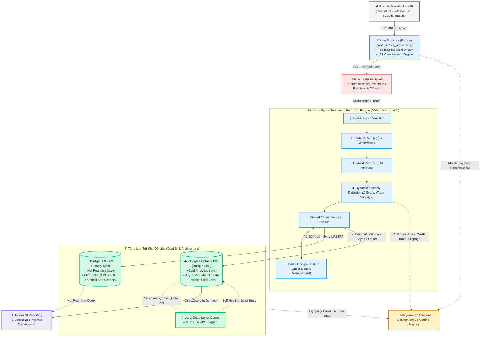
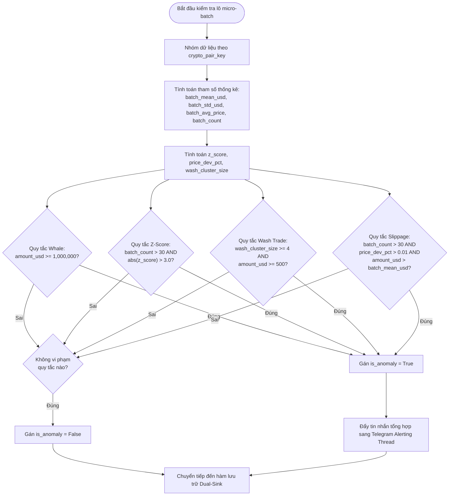
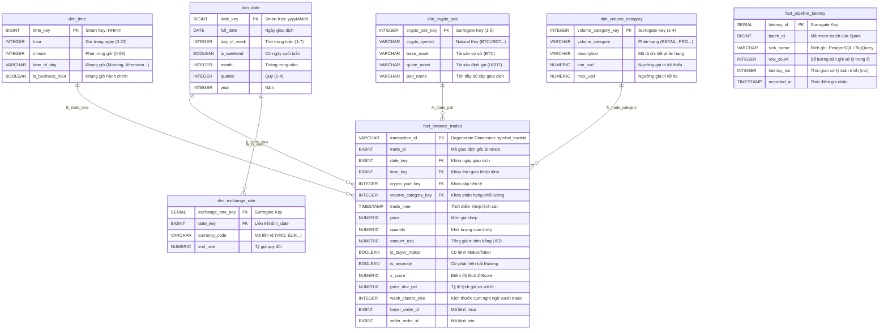

# ⚡ Real-Time Crypto Streaming Pipeline & Dual-Sink Data Warehouse
### Ingestion, Dynamic Anomaly Detection & Kimball Star Schema Analytics

[](https://www.python.org/)
[](https://kafka.apache.org/)
[](https://spark.apache.org/)
[](https://www.postgresql.org/)
[](https://cloud.google.com/bigquery)
[](https://powerbi.microsoft.com/)
[](https://www.docker.com/)
[](LICENSE)

> **🎬 Video Demo Vận Hành Trực Tiếp Hệ Thống:** [Xem trên YouTube](https://www.youtube.com/watch?v=GCkgsPlZs2A)  
> **🎓 Đề tài Khóa Luận Tốt Nghiệp:** Khoa Công nghệ Thông tin – Trường Đại học Thăng Long (2026).

---

## 📌 Mục Lục (Table of Contents)

1. [📖 Giới Thiệu & Bối Cảnh Nghiên Cứu](#1--giới-thiệu--bối-cảnh-nghiên-cứu)
   - [1.1. Bối cảnh & Thách thức thị trường](#11-bối-cảnh--thách-thức-thị-trường)
   - [1.2. Giải pháp & Các tính năng cốt lõi](#12-giải-pháp--các-tính-năng-cốt-lõi)
   - [1.3. Nguồn dữ liệu & Phạm vi thu thập](#13-nguồn-dữ-liệu--phạm-vi-thu-thập)
2. [🛠️ Công Nghệ & Thành Phần Hệ Thống](#2-️-công-nghệ--thành-phần-hệ-thống)
3. [🏗️ Kiến Trúc Hệ Thống Tổng Thể](#3-️-kiến-trúc-hệ-thống-tổng-thể)
   - [3.1. Sơ đồ kiến trúc 5 tầng](#31-sơ-đồ-kiến-trúc-5-tầng)
   - [3.2. Luồng dữ liệu xử lý End-to-End](#32-luồng-dữ-liệu-xử-lý-end-to-end)
4. [⚙️ Chi Tiết Triển Khai Kỹ Thuật Từng Tầng](#4-️-chi-tiết-triển-khai-kỹ-thuật-từng-tầng)
   - [4.1. Tầng Thu thập (Live Producer & Nén LZ4)](#41-tầng-thu-thập-live-producer--nén-lz4)
   - [4.2. Tầng Xử lý Luồng Spark (Quy trình 7 bước & Khử trùng 2 lớp)](#42-tầng-xử-lý-luồng-spark-quy-trình-7-bước--khử-trùng-2-lớp)
   - [4.3. Mô hình Phát hiện Bất thường Thống kê Động](#43-mô-hình-phát-hiện-bất-thường-thống-kê-động)
   - [4.4. Tầng Kho Dữ Liệu (Kimball Star Schema DW)](#44-tầng-kho-dữ-liệu-kimball-star-schema-dw)
   - [4.5. Cơ chế Dual-Sink, Kháng Lỗi & Tự Chữa Lành (Self-Healing DLQ)](#45-cơ-chế-dual-sink-kháng-lỗi--tự-chữa-lành-self-healing-dlq)
   - [4.6. Tầng Giám Sát & Cảnh Báo Telegram Bất Đồng Bộ](#46-tầng-giám-sát--cảnh-báo-telegram-bất-đồng-bộ)
5. [📊 Báo Cáo Phân Tích & Trực Quan Hóa (Power BI)](#5--báo-cáo-phân-tích--trực-quan-hóa-power-bi)
6. [📈 Kết Quả Thực Nghiệm & Đo Lường Hiệu Năng](#6--kết-quả-thực-nghiệm--đo-lường-hiệu-năng)
7. [📁 Cấu Trúc Thư Mục Dự Án](#7--cấu-trúc-thư-mục-dự-án)
8. [🚀 Hướng Dẫn Cài Đặt & Triển Khai Nhanh](#8--hướng-dẫn-cài-đặt--triển-khai-nhanh)
   - [8.1. Yêu cầu tiên quyết](#81-yêu-cầu-tiên-quyết)
   - [8.2. Cấu hình biến môi trường](#82-cấu-hình-biến-môi-trường)
   - [8.3. Khởi chạy hệ thống bằng Makefile](#83-khởi-chạy-hệ-thống-bằng-makefile)
   - [8.4. Lệnh kiểm thử, đối soát & bơm dữ liệu bất thường](#84-lệnh-kiểm-thử-đối-soát--bơm-dữ-liệu-bất-thường)
9. [🔮 Hướng Phát Triển Tương Lai](#9--hướng-phát-triển-tương-lai)
10. [📜 Giấy Phép & Thông Tin Tác Giả](#10--giấy-phép--thông-tin-tác-giả)

---

## 1. 📖 Giới Thiệu & Bối Cảnh Nghiên Cứu

### 1.1. Bối cảnh & Thách thức thị trường
Thị trường tiền mã hóa (Cryptocurrency) vận hành phi tập trung và liên tục **24/7/365**, tạo ra lưu lượng giao dịch tần suất cao (High-Frequency Trading - HFT) với khối lượng hàng chục nghìn thông điệp mỗi giây. Trong môi trường này, các biến động rủi ro xảy ra chỉ trong chớp mắt:
- **Giao dịch Cá voi (Whale Dumping/Pumping):** Các lệnh mua/bán đột biến hàng triệu USD gây xáo trộn sổ lệnh.
- **Thao túng thanh khoản ảo (Wash Trading):** Các thuật toán Bot tự mua tự bán tại cùng một thời điểm mili-giây nhằm thổi phồng khối lượng giao dịch.
- **Trượt giá nghiêm trọng (Flash Slippage):** Tác động thanh khoản làm giá khớp lệnh lệch sâu so với kỳ vọng thị trường.

Các giải pháp xử lý dữ liệu theo lô truyền thống (Batch ETL) với độ trễ từ vài chục phút đến hàng giờ hoàn toàn bất lực trong việc cảnh báo sớm. Trong khi đó, các dịch vụ phân tích SaaS thương mại là mã nguồn đóng, chi phí bản quyền đắt đỏ và không cho phép tùy biến thuật toán phát hiện bất thường đặc thù.

### 1.2. Giải pháp & Các tính năng cốt lõi
Dự án xây dựng một **Streaming Data Pipeline** mã nguồn mở hoàn chỉnh, tối ưu hóa từ thu thập, vận chuyển, tính toán phân tán đến lưu trữ và trực quan hóa:
- ⚡ **Độ trễ xử lý sub-second:** Toàn trình từ khi phát sinh giao dịch trên sàn đến khi lưu vào kho dữ liệu chỉ từ **150 – 450 ms**.
- 🛡️ **Khử trùng lặp 2 lớp (Two-Layer Deduplication):** Kết hợp Spark Stateful Watermark 30s với PostgreSQL PK UPSERT, bảo đảm tỷ lệ trùng lặp dữ liệu là **0%** (Exactly-once semantics at sink).
- 🧠 **Bộ lọc bất thường động 4 chiều:** Đánh giá rủi ro theo khung lý thuyết phân loại chuẩn *(Chandola et al., 2009)* ngay trong chu kỳ micro-batch 200ms.
- 🗄️ **Kho dữ liệu chuẩn Kimball Star Schema:** Thiết kế 2 bảng Fact và 5 bảng Dimension tối ưu hóa truy vấn phân tích bằng Khóa thay thế số nguyên (Integer Surrogate Keys).
- 🔄 **Lưu trữ Kép (Dual-Sink) & Tự Chữa Lành (Self-Healing DLQ):** Kết hợp PostgreSQL (lưu trữ nóng real-time) và Google BigQuery (lưu trữ phân tích dung lượng lớn) kèm cơ chế Dead-Letter Queue cách ly lỗi mạng.
- 🔔 **Cảnh báo tức thời qua Telegram Bot:** Luồng cảnh báo bất đồng bộ gửi thông báo ngay khi xuất hiện sự cố hệ thống hoặc biến động thị trường dị biệt.

### 1.3. Nguồn dữ liệu & Phạm vi thu thập
Hệ thống áp dụng chiến lược **Dữ liệu Kép (Hybrid Data Strategy)**:
1. **Dữ liệu Thời Gian Thực (Live Stream):** Kết nối trực tiếp qua Binance Multi-Stream WebSocket API (`wss://stream.binance.com:9443`) trên **5 cặp giao dịch có thanh khoản lớn nhất**:
   - `BTC/USDT`, `ETH/USDT`, `BNB/USDT`, `SOL/USDT`, `XRP/USDT`.
2. **Dữ liệu Lịch Sử (Historical Backfill):** Tải và nạp bù dữ liệu khớp lệnh lịch sử từ kho lưu trữ mở của Binance (`data.binance.vision`) phục vụ đối soát, kiểm định mô hình và phân tích xu hướng dài hạn trên BI Dashboard.

---

## 2. 🛠️ Công Nghệ & Thành Phần Hệ Thống

| Tầng chức năng | Công nghệ sử dụng | Phiên bản | Vai trò kiến trúc |
| :--- | :--- | :--- | :--- |
| **Ingestion Layer** | Python WebSocket Client | 3.10+ / v1.6+ | Kết nối luồng WebSocket Binance, duy trì heartbeat, nén dữ liệu |
| **Message Broker** | Apache Kafka & Zookeeper | Confluent 7.5.0 | Đệm hàng đợi thông điệp phân tán, đệm luồng, chịu tải đột biến |
| **Stream Processing** | Apache Spark (Structured Streaming) | 3.5.4 | Động cơ tính toán phân tán, biến đổi dữ liệu, phát hiện bất thường |
| **Hot Storage (OLTP/DW)** | PostgreSQL | 16.x | Kho dữ liệu hoạt động phục vụ truy vấn real-time, áp dụng Star Schema |
| **Cold Storage (OLAP)** | Google Cloud BigQuery | Cloud Serverless | Kho dữ liệu đám mây phục vụ phân tích quy mô lớn và lưu trữ dài hạn |
| **Fault-Tolerance** | Local DLQ & PyArrow Parquet | 14.0+ | Lưu trữ cách ly các batch ghi BigQuery thất bại, tự động nạp bù |
| **Real-time Alerting** | Telegram Bot API & Discord Webhook | REST API | Cảnh báo biến động thị trường và sự cố đường ống bất đồng bộ |
| **Business Intelligence** | Microsoft Power BI Desktop | Latest | Trực quan hóa dữ liệu đa chiều, theo dõi dòng tiền và hành vi bot |
| **Containerization** | Docker & Docker Compose | v2+ | Đóng gói hạ tầng, thiết lập môi trường đồng nhất và độc lập |

---

## 3. 🏗️ Kiến Trúc Hệ Thống Tổng Thể

### 3.1. Sơ đồ kiến trúc 5 tầng


```mermaid
graph TD
    classDef external fill:#F3F4F6,stroke:#4B5563,stroke-width:2px;
    classDef broker fill:#FFE4E6,stroke:#F43F5E,stroke-width:2px;
    classDef processing fill:#E0F2FE,stroke:#0EA5E9,stroke-width:2px;
    classDef storage fill:#D1FAE5,stroke:#10B981,stroke-width:2px;
    classDef alert fill:#FEF3C7,stroke:#D97706,stroke-width:2px;
    classDef bi fill:#EDE9FE,stroke:#8B5CF6,stroke-width:2px;

    %% Source & Ingestion
    BinanceWS["🌐 Binance WebSocket API<br/>(btcusdt, ethusdt, bnbusdt, solusdt, xrpusdt)"]:::external
    Producer["📡 Live Producer (Python)<br/>(producer/live_producer.py)<br/>• Non-blocking Multi-stream<br/>• LZ4 Compression Engine"]:::processing

    %% Messaging
    Kafka["📨 Apache Kafka Broker<br/>(Topic: payment_events_v3<br/>Partitions & Offsets)"]:::broker

    %% Processing
    subgraph SparkCore ["⚡ Apache Spark Structured Streaming Engine (200ms Micro-batch)"]
        Clean["1. Type Cast & Cleansing"]:::processing
        Dedup["2. Stateful Dedup (30s Watermark)"]:::processing
        Derive["3. Derived Metrics (USD Amount)"]:::processing
        Anomaly["4. Dynamic Anomaly Detection (Z-Score, Wash, Slippage)"]:::processing
        SKGen["5. Kimball Surrogate Key Lookup"]:::processing
        Checkpoint["📂 Spark Checkpoint Store<br/>(Offset & State Management)"]:::processing
    end

    %% Storage Dual-Sink
    subgraph Storage ["🗄️ Tầng Lưu Trữ Kho Dữ Liệu (Dual-Sink Architecture)"]
        Postgres[("🐘 PostgreSQL DW (Primary Sink)<br/>• Hot Real-time Layer<br/>• UPSERT ON CONFLICT<br/>• Kimball Star Schema")]:::storage
        BQ[("☁️ Google BigQuery DW (Backup Sink)<br/>• Cold Analytics Layer<br/>• Async Micro-batch Buffer<br/>• Parquet Load Jobs")]:::storage
        DLQ["📁 Local Dead-Letter Queue<br/>(dlq_bq_failed/*.parquet)"]:::storage
    end

    %% Monitoring & BI
    Telegram["💬 Telegram Bot Channel<br/>(Asynchronous Alerting Engine)"]:::alert
    PowerBI["📊 Power BI Reporting<br/>(5 Specialized Analytic Dashboards)"]:::bi

    %% Connections
    BinanceWS -->|"Raw JSON Stream"| Producer
    Producer -->|"LZ4 Encoded Bytes"| Kafka
    Kafka -->|"Micro-batch Stream"| Clean
    Clean --> Dedup --> Derive --> Anomaly --> SKGen
    SKGen <--> Checkpoint

    SKGen -->|"1. Đồng bộ - Sync UPSERT"| Postgres
    SKGen -->|"2. Đệm bất đồng bộ - Async Parquet"| BQ
    BQ -.->|"Sự cố mạng hoặc Quota API"| DLQ
    DLQ -.->|"Self-Healing Script Retry"| BQ

    %% Alert links
    Producer -.->|"Mất kết nối hoặc Reconnect fail"| Telegram
    Anomaly -.->|"Phát hiện Whale, Wash Trade, Slippage"| Telegram
    Storage -.->|"BigQuery Down: Lưu vào DLQ"| Telegram

    %% BI link
    BQ -->|"DirectQuery hoặc Import"| PowerBI
    Postgres -.->|"Hot Real-time Query"| PowerBI
```

### 3.2. Luồng dữ liệu xử lý End-to-End
1. **Thu thập (Ingestion):** Producer nhận dữ liệu khớp lệnh dạng JSON từ Binance WebSocket, nén bằng giải thuật `lz4` và đẩy tức thời vào Kafka topic `payment_events_v3`.
2. **Tiêu thụ & Phân giải (Parsing):** Spark Structured Streaming định kỳ đọc micro-batch (chu kỳ trigger **200 mili-giây**), giải mã schema và làm sạch dữ liệu rác.
3. **Khử trùng lặp (Deduplication):** Spark áp dụng Stateful Watermark 30s trên khóa tự nhiên `transaction_id = crypto_symbol + "_" + trade_id` để loại bỏ các bản ghi trùng lặp do mạng gửi lại.
4. **Phát hiện bất thường (Anomaly Detection):** Trong mỗi micro-batch, Spark tính toán các tham số thống kê động trên cửa sổ trượt (trung bình, độ lệch chuẩn, cụm trùng thời gian) để gắn cờ các giao dịch bất thường.
5. **Chuẩn hóa Star Schema (Enrichment):** Ánh xạ các trường thông tin sang Surrogate Keys số nguyên (`date_key`, `time_key`, `crypto_pair_key`, `volume_category_key`).
6. **Lưu trữ Dual-Sink (Storage):**
   - **PostgreSQL:** Thực hiện UPSERT tức thời với `psycopg2.extras.execute_values` nhằm đảm bảo dữ liệu nóng hiển thị ngay lập tức.
   - **BigQuery:** Đệm bộ nhớ cục bộ, xuất định dạng Parquet và tải lên đám mây khi đạt 5.000 dòng hoặc đủ 60 giây. Nếu tải thất bại, cơ chế DLQ tự động cách ly tệp tin vào thư mục `dlq_bq_failed/`.
7. **Cảnh báo & Trực quan (Alerting & BI):** Các giao dịch bất thường và sự cố pipeline được gửi tức thì về Telegram Bot mà không làm tắc nghẽn luồng xử lý Spark; Power BI kết nối vào kho dữ liệu để người dùng phân tích chuyên sâu.

---

## 4. ⚙️ Chi Tiết Triển Khai Kỹ Thuật Từng Tầng

### 4.1. Tầng Thu thập (Live Producer & Nén LZ4)
Thành phần `producer/live_producer.py` được thiết kế tuân thủ nghiêm ngặt **Nguyên lý Đơn nhiệm (Single Responsibility Principle - SRP)**:
- **Chỉ tiếp nhận và chuyển tiếp:** Producer không thực hiện bất kỳ tính toán nghiệp vụ nặng nào trên luồng nhằm tránh làm nghẽn socket và đứt kết nối WebSocket.
- **Tối ưu hóa nén dữ liệu (LZ4 Compression):** Bật cờ `compression_type='lz4'` tại Kafka Producer giúp kích thước gói tin giảm **~50%**, tiết kiệm đáng kể băng thông mạng và tăng thông lượng đẩy thông điệp.
- **Tự động phục hồi kết nối (Auto-Reconnect):** Cơ chế vòng lặp `while True` với Exponential Backoff tự động tái kết nối WebSocket và Kafka Broker khi xảy ra sự cố gián đoạn đường truyền.

**Cấu trúc gói tin JSON thô từ sàn Binance:**
```json
{
  "e": "trade",
  "E": 1718280000123,
  "s": "BTCUSDT",
  "t": 3589218942,
  "p": "67450.50000000",
  "q": "0.15420000",
  "b": 28491029412,
  "a": 28491029851,
  "T": 1718280000120,
  "m": true,
  "M": true
}
```

---

### 4.2. Tầng Xử lý Luồng Spark (Quy trình 7 bước & Khử trùng 2 lớp)
Bộ xử lý trung tâm `processor/spark_processor.py` vận hành theo quy trình tính toán phân tán 7 bước tối ưu bộ nhớ:

| Bước | Phân đoạn xử lý | Chi tiết kỹ thuật |
| :---: | :--- | :--- |
| **B1** | **Type Casting** | Chuyển đổi dữ liệu chuỗi (`String`) từ JSON thô sang kiểu số học phù hợp (`DoubleType`, `LongType`, `Timestamp`). |
| **B2** | **Data Cleansing** | Bộ lọc điều kiện loại bỏ dữ liệu sai lệch logic: `price > 0`, `quantity > 0` và loại bỏ các trường thiếu giá trị (`Null`). |
| **B3** | **Deduplication** | Khử trùng lặp thông qua khóa ghép tự nhiên `transaction_id = crypto_symbol_trade_id` kết hợp Watermark 30s. |
| **B4** | **Transformation** | Tính toán trường dữ liệu phái sinh: Giá trị khớp lệnh quy đổi sang USD ($Amount_{USD} = Price \times Quantity$). |
| **B5** | **Volume Classification** | Phân hạng quy mô giao dịch theo giá trị USD: `1=RETAIL` (<$10k), `2=PRO` ($10k-$100k), `3=INST` ($100k-$1M), `4=WHALE` ($\ge$ $1M). |
| **B6** | **Anomaly Detection** | Áp dụng Window Function trong `foreachBatch` đánh giá phân phối chuẩn Z-Score, cụm thao túng bot và độ trượt giá. |
| **B7** | **Star Schema Keys** | Sinh các khóa thay thế số nguyên: `date_key` (yyyyMMdd), `time_key` (HHmm), `crypto_pair_key` (1-5) phục vụ kết nối Star Schema. |

```
                       CHIẾN LƯỢC KHỬ TRÙNG LẶP 2 LỚP
┌─────────────────────────────────────────────────────────────────────────────┐
│ Lớp 1: Spark Stateful Deduplication                                         │
│ • dropDuplicates(["transaction_id"])                                        │
│ • withWatermark("trade_time", "30 seconds")                                 │
│ ➜ Loại bỏ 100% các thông điệp trùng lặp tức thời trong cửa sổ trượt RAM.   │
└──────────────────────────────────────┬──────────────────────────────────────┘
                                       │ (Nếu có bản ghi trôi ngoài cửa sổ 30s)
                                       ▼
┌─────────────────────────────────────────────────────────────────────────────┐
│ Lớp 2: PostgreSQL Storage-level Idempotent UPSERT                           │
│ • INSERT INTO fact_binance_trades (...) VALUES (...)                        │
│ • ON CONFLICT (transaction_id) DO UPDATE SET price = EXCLUDED.price, ...    │
│ ➜ Bảo đảm tính toàn vẹn và nhất quán tuyệt đối, không trùng lặp ở đích ghi.│
└─────────────────────────────────────────────────────────────────────────────┘
```

---

### 4.3. Mô hình Phát hiện Bất thường Thống kê Động
Dựa trên nền tảng lý thuyết phân loại bất thường của *Chandola et al. (2009)*, hệ thống tính toán thống kê động ngay trên lô micro-batch hiện tại của Spark:

#### 1. Bất thường điểm (Point Anomaly) — Quy tắc Whale & Z-Score
- **Giao dịch Cá Voi (Whale Alert):** Lệnh có giá trị quy đổi cực lớn:
  $$\text{Whale Alert} \iff Amount_{USD} \ge \$1,000,000$$
- **Chỉ số Z-Score Outlier:** Phát hiện các giao dịch có độ lệch đột biến so với hành vi chung của đồng coin trong lô:
  $$Z = \frac{x - \mu}{\sigma}$$
  *Trong đó:* $x$ là giá trị giao dịch, $\mu$ là trung bình lô (`batch_mean_usd`), $\sigma$ là độ lệch chuẩn lô (`batch_std_usd`).  
  *Điều kiện:* $|Z| > 3.0$ và cỡ mẫu trong lô $N > 30$ bản ghi nhằm bảo đảm ý nghĩa thống kê.

#### 2. Bất thường nhóm (Collective Anomaly) — Phát hiện Wash Trading Bot
Nhận diện hành vi tự khớp lệnh tạo khối lượng giả tạo của các thuật toán bot HFT:
$$\text{Wash Cluster} = \{ \text{trades} \mid \text{same Symbol, Price, Quantity, Millisecond timestamp} \}$$
*Điều kiện:* Kích thước cụm giao dịch trùng lặp $\ge 4$ lệnh và tổng giá trị cụm $Amount_{USD} \ge \$500$.

#### 3. Bất thường ngữ cảnh (Contextual Anomaly) — Trượt giá & Tác động thị trường (Price Slippage)
Phát hiện các giao dịch khớp lệnh đẩy giá trượt quá sâu so với mức định giá trung bình trong cùng một micro-batch:
$$\text{Price Deviation Pct} = \frac{|Price - \bar{P}_{batch}|}{\bar{P}_{batch}}$$
*Điều kiện:* Tỷ lệ trượt giá $\text{price\_dev\_pct} > 0.01$ (lệch trên 1%) đồng thời giá trị giao dịch lớn hơn trung bình lô ($Amount_{USD} > \mu$).

#### 📊 Sơ đồ logic kiểm tra bất thường trong Spark micro-batch:

```mermaid
flowchart TD
    Start(["Bắt đầu kiểm tra lô micro-batch"]) --> Group["Nhóm dữ liệu theo crypto_pair_key"]
    Group --> Calc["Tính toán tham số thống kê:<br/>batch_mean_usd, batch_std_usd, batch_avg_price, batch_count"]
    Calc --> Eval["Tính toán z_score, price_dev_pct, wash_cluster_size"]
    
    Eval --> R1{"Quy tắc Whale:<br/>amount_usd >= 1,000,000?"}
    Eval --> R2{"Quy tắc Z-Score:<br/>batch_count > 30 AND<br/>abs(z_score) > 3.0?"}
    Eval --> R3{"Quy tắc Wash Trade:<br/>wash_cluster_size >= 4 AND<br/>amount_usd >= 500?"}
    Eval --> R4{"Quy tắc Slippage:<br/>batch_count > 30 AND<br/>price_dev_pct > 0.01 AND<br/>amount_usd > batch_mean_usd?"}

    R1 -- "Đúng" --> FlagTrue["Gán is_anomaly = True"]
    R2 -- "Đúng" --> FlagTrue
    R3 -- "Đúng" --> FlagTrue
    R4 -- "Đúng" --> FlagTrue

    R1 -- "Sai" --> CheckAll{"Không vi phạm<br/>quy tắc nào?"}
    R2 -- "Sai" --> CheckAll
    R3 -- "Sai" --> CheckAll
    R4 -- "Sai" --> CheckAll

    CheckAll -- "Đúng" --> FlagFalse["Gán is_anomaly = False"]
    
    FlagTrue --> PushAlert["Đẩy tin nhắn tổng hợp sang Telegram Alerting Thread"]
    FlagFalse --> SinkDW["Chuyển tiếp đến hàm lưu trữ Dual-Sink"]
    PushAlert --> SinkDW
```

---

### 4.4. Tầng Kho Dữ Liệu (Kimball Star Schema DW)

Kho dữ liệu được xây dựng chuẩn hóa theo phương pháp luận **Ralph Kimball**:
- **Khóa thay thế số nguyên (Integer Surrogate Keys):** Sử dụng các khóa số nguyên thay vì khóa tự nhiên chuỗi ký tự (`VARCHAR`) giúp tăng tốc độ thực thi các câu lệnh `JOIN` và giảm tới 40% dung lượng lưu trữ chỉ mục (Indexes).
- **Phân tách Date và Time Dimensions:** Tách riêng `dim_date` (yyyyMMdd) và `dim_time` (HHmm) cho phép phân tích hành vi thị trường theo giờ trong ngày hoặc theo ngày trong tuần độc lập, hạn chế tối đa kích thước bảng Dimension thời gian.
- **Fact Giám sát Độ trễ (`fact_pipeline_latency`):** Lưu trữ định lượng từng chu kỳ xử lý (batch ID, sink name, số dòng, độ trễ mili-giây) phục vụ kiểm định chất lượng đường ống.


```mermaid
erDiagram
    dim_date {
        BIGINT date_key PK "Smart Key: yyyyMMdd"
        DATE full_date "Ngày giao dịch"
        INTEGER day_of_week "Thứ trong tuần (1-7)"
        BOOLEAN is_weekend "Cờ ngày cuối tuần"
        INTEGER month "Tháng trong năm"
        INTEGER quarter "Quý (1-4)"
        INTEGER year "Năm"
    }

    dim_time {
        BIGINT time_key PK "Smart Key: HHmm"
        INTEGER hour "Giờ trong ngày (0-23)"
        INTEGER minute "Phút trong giờ (0-59)"
        VARCHAR time_of_day "Khung giờ (Morning, Afternoon...)"
        BOOLEAN is_business_hour "Khung giờ hành chính"
    }

    dim_crypto_pair {
        INTEGER crypto_pair_key PK "Surrogate Key (1-5)"
        VARCHAR crypto_symbol "Natural Key (BTCUSDT...)"
        VARCHAR base_asset "Tài sản cơ sở (BTC)"
        VARCHAR quote_asset "Tài sản định giá (USDT)"
        VARCHAR pair_name "Tên đầy đủ cặp giao dịch"
    }

    dim_volume_category {
        INTEGER volume_category_key PK "Surrogate Key (1-4)"
        VARCHAR volume_category "Phân hạng (RETAIL, PRO...)"
        VARCHAR description "Mô tả chi tiết phân hạng"
        NUMERIC min_usd "Ngưỡng giá trị tối thiểu"
        NUMERIC max_usd "Ngưỡng giá trị tối đa"
    }

    dim_exchange_rate {
        SERIAL exchange_rate_key PK "Surrogate Key"
        BIGINT date_key FK "Liên kết dim_date"
        VARCHAR currency_code "Mã tiền tệ (VND, EUR...)"
        NUMERIC vnd_rate "Tỷ giá quy đổi"
    }

    fact_binance_trades {
        VARCHAR transaction_id PK "Degenerate Dimension: symbol_tradeid"
        BIGINT trade_id "Mã giao dịch gốc Binance"
        BIGINT date_key FK "Khóa ngày giao dịch"
        BIGINT time_key FK "Khóa thời gian khớp lệnh"
        INTEGER crypto_pair_key FK "Khóa cặp tiền tệ"
        INTEGER volume_category_key FK "Khóa phân hạng khối lượng"
        TIMESTAMP trade_time "Thời điểm khớp lệnh sàn"
        NUMERIC price "Mức giá khớp"
        NUMERIC quantity "Khối lượng coin khớp"
        NUMERIC amount_usd "Tổng giá trị tính bằng USD"
        BOOLEAN is_buyer_maker "Cờ lệnh Maker/Taker"
        BOOLEAN is_anomaly "Cờ phát hiện bất thường"
        NUMERIC z_score "Điểm độ lệch Z-Score"
        NUMERIC price_dev_pct "Tỷ lệ lệch giá so với lô"
        INTEGER wash_cluster_size "Kích thước cụm nghi ngờ wash trade"
        BIGINT buyer_order_id "Mã lệnh mua"
        BIGINT seller_order_id "Mã lệnh bán"
    }

    fact_pipeline_latency {
        SERIAL latency_id PK "Surrogate Key"
        BIGINT batch_id "Mã micro-batch của Spark"
        VARCHAR sink_name "Đích ghi: PostgreSQL / BigQuery"
        INTEGER row_count "Số lượng bản ghi xử lý trong lô"
        INTEGER latency_ms "Thời gian xử lý toàn trình (ms)"
        TIMESTAMP recorded_at "Thời điểm ghi nhận"
    }

    dim_date ||--o{ fact_binance_trades : "fk_trade_date"
    dim_time ||--o{ fact_binance_trades : "fk_trade_time"
    dim_crypto_pair ||--o{ fact_binance_trades : "fk_trade_pair"
    dim_volume_category ||--o{ fact_binance_trades : "fk_trade_category"
    dim_date ||--o{ dim_exchange_rate : "fk_fx_date"
```

#### Bảng Ánh Xạ Phân Hạng Khối Lượng Giao Dịch (`dim_volume_category`):
| Surrogate Key | Mã phân hạng (`volume_category`) | Ngưỡng giá trị USD | Đối tượng giao dịch điển hình |
| :---: | :--- | :--- | :--- |
| **1** | `RETAIL` | $\$0 - \$10,000$ | Nhà đầu tư cá nhân nhỏ lẻ |
| **2** | `PROFESSIONAL` | $\$10,000 - \$100,000$ | Nhà giao dịch chuyên nghiệp, Day trader |
| **3** | `INSTITUTIONAL` | $\$100,000 - \$1,000,000$ | Quỹ đầu tư, Tổ chức tài chính quy mô vừa |
| **4** | `WHALE` | $\ge \$1,000,000$ | Cá mập thị trường (Whale), Quỹ thanh khoản lớn |

---

### 4.5. Cơ chế Dual-Sink, Kháng Lỗi & Tự Chữa Lành (Self-Healing DLQ)

```
                            KIẾN TRÚC DUAL-SINK & KHÁNG LỖI
                                ┌─────────────────────────┐
                                │ Spark foreachBatch (DF) │
                                └────────────┬────────────┘
                     ┌───────────────────────┴───────────────────────┐
                     ▼                                               ▼
      ┌──────────────────────────────┐              ┌─────────────────────────────────┐
      │ Primary Sink: PostgreSQL DW  │              │ Backup Sink: Google BigQuery    │
      │ • Đồng bộ trực tiếp (Sync)   │              │ • Đệm bất đồng bộ (Async Buffer)│
      │ • UPSERT ON CONFLICT         │              │ • Parquet Load Job định kỳ      │
      │ • Rollback transaction lỗi   │              └────────────────┬────────────────┘
      └──────────────────────────────┘                               │ (Sự cố mạng / Cloud Down)
                                                                     ▼
                                                    ┌─────────────────────────────────┐
                                                    │ Dead-Letter Queue (DLQ Folder)  │
                                                    │ Lưu tệp: dlq_bq_failed/*.parquet│
                                                    └────────────────┬────────────────┘
                                                                     │
                                                    ┌────────────────┴────────────────┐
                                                    │ Self-Healing Engine (Cron Job)  │
                                                    │ Chạy: retry_dlq_to_bq.py        │
                                                    │ ➜ Nạp bù dữ liệu vào BigQuery   │
                                                    └─────────────────────────────────┘
```

#### So sánh kỹ thuật hai đích ghi:
| Tiêu chí so sánh | PostgreSQL (Primary Sink) | Google BigQuery (Backup Sink) |
| :--- | :--- | :--- |
| **Vai trò kiến trúc** | Tác nghiệp nóng (Hot Data Layer), truy vấn ngay | Phân tích kho dữ liệu lớn (Cold Analytics Layer) |
| **Chế độ xử lý** | Đồng bộ trực tiếp trong `foreachBatch` | Bất đồng bộ qua Bộ đệm RAM (`BQ_BUFFER`) |
| **Phương thức tải** | Batch UPSERT qua `execute_values` | Parquet Load Job thông qua `google-cloud-bigquery` |
| **Điều kiện kích hoạt** | Xử lý ngay sau mỗi micro-batch (200ms) | Khi bộ đệm đạt $\ge 5.000$ dòng hoặc đủ $60\text{ giây}$ |
| **Chiến lược khử trùng**| `ON CONFLICT (transaction_id) DO UPDATE` | `WRITE_APPEND` (Tối ưu chi phí ghi phân tán) |
| **Kháng lỗi & Phục hồi** | Rollback connection pool tự động | Chuyển file Parquet sang thư mục DLQ; nạp bù sau |

#### Cơ chế Tự Chữa Lành (Self-Healing):
Khi Spark không thể ghi vào BigQuery do mất kết nối mạng Internet hoặc hết hạn ngạch API:
1. Luồng ghi PostgreSQL **vẫn hoạt động bình thường**, không làm sập toàn bộ hệ thống pipeline.
2. Dữ liệu lỗi được chuyển thành tệp nén Parquet lưu an toàn vào thư mục `dlq_bq_failed/`.
3. Script `scripts/retry_dlq_to_bq.py` được lập lịch tự động: Quét thư mục DLQ, kiểm tra kết nối Google Cloud, nạp bù dữ liệu vào BigQuery và di chuyển tệp thành công vào thư mục lưu trữ đối soát `dlq_bq_success/`.
4. Script đồng thời tích hợp bộ kiểm tra sức khỏe: Cảnh báo qua Telegram/Discord khi dung lượng đĩa trống $< 10\%$ hoặc số lượng file tồn đọng trong DLQ $\ge 20$ file.

---

### 4.6. Tầng Giám Sát & Cảnh Báo Telegram Bất Đồng Bộ
Hệ thống sử dụng kỹ thuật **Asynchronous Multi-Threading** để gửi thông báo về kênh Telegram của quản trị viên mà không làm tăng thời gian xử lý của chu kỳ micro-batch:

- **🚨 Cảnh báo Lỗi Hệ Thống (System Failures):**
  - **Producer Down:** Gửi cảnh báo khi mất kết nối WebSocket Binance hoặc Kafka Broker không phản hồi.
  - **BigQuery DLQ Triggered:** Thông báo khi việc tải dữ liệu lên đám mây gặp sự cố và tệp Parquet đã được cách ly vào hàng đợi DLQ.
- **🔔 Cảnh báo Biến Động Thị Trường (Market Anomalies):**
  - **Whale Alert:** Khi xuất hiện lệnh đơn lẻ $\ge \$1,000,000$.
  - **Wash Trading Alert:** Khi phát hiện cụm từ 4 giao dịch cùng mili-giây nghi vấn Bot thao túng volume.
  - **Price Slippage Alert:** Khi độ lệch giá vượt $1\%$ kèm theo khối lượng giao dịch đột biến.
- **Chống ngập thông điệp (Rate-Limit Protection):** Gom nhóm toàn bộ cảnh báo trong cùng một micro-batch thành một thông điệp Markdown duy nhất, tránh tình trạng bị Telegram giới hạn tần suất gửi (HTTP 429 Too Many Requests).

---

## 5. 📊 Báo Cáo Phân Tích & Trực Quan Hóa (Power BI)

*(Bộ Dashboard chuyên sâu gồm 5 trang báo cáo được kết nối trực tiếp với BigQuery Data Warehouse)*

### 1. Phân Tích Thanh Khoản & Dòng Tiền (Liquidity & Cash Flow)
Theo dõi cơ cấu dòng tiền vào/ra thị trường, tỷ trọng giao dịch của từng cặp tiền mã hóa theo thời gian thực và phân loại tỷ trọng giữa các phân khúc nhà đầu tư (Retail, Professional, Whale).


---

### 2. Giám Sát Hành Vi Cá Mập (Whale Tracking & Behavior)
Truy vết các giao dịch quy mô lớn từ $1,000,000 USD trở lên. Phân tích tương quan giữa các đợt gom hàng/xả hàng của Cá Voi với biến động giá tức thời trên sổ lệnh.


---

### 3. Cảnh Báo Rủi Ro & Giao Dịch Bất Thường (Risk & Anomaly Warnings)
Thống kê tổng hợp số lượng giao dịch bị gắn cờ bất thường theo từng cặp tiền, mức độ phân tán của Z-Score và các đợt biến động giá dị biệt (Price Slippage).


---

### 4. Nhận Diện Thuật Toán BOT Thao Túng (Wash Trading Detection)
Liệt kê chi tiết các cụm giao dịch có cùng mức giá, khối lượng và khớp lệnh trong cùng một mili-giây. Giúp nhà đầu tư phát hiện các đợt bơm thanh khoản ảo của các sàn hoặc đội tạo lập thị trường (Market Makers).


---

### 5. Giám Sát Hiệu Năng Pipeline & Độ Trễ (Pipeline Performance & Latency)
Báo cáo trực quan hóa bảng `fact_pipeline_latency`. Theo dõi độ trễ toàn trình (E2E Latency) theo từng giây, số lượng bản ghi xử lý trong mỗi micro-batch và tốc độ phản hồi của từng đích ghi (PostgreSQL vs BigQuery).


---

## 6. 📈 Kết Quả Thực Nghiệm & Đo Lường Hiệu Năng

### Thông số môi trường thực nghiệm:
- **Hạ tầng phần cứng:** Intel Core i7, 16GB RAM, SSD NVMe 512GB, Windows 11 64-bit.
- **Môi trường ảo hóa:** Docker Desktop (Kafka, Zookeeper, PostgreSQL Container).
- **Môi trường tính toán:** Spark 3.5.4 chạy chế độ phân tán cục bộ `local[*]`.

### Bảng kết quả kiểm định chất lượng:
| Chỉ số kiểm thử | Ngưỡng mục tiêu | Kết quả thực nghiệm đo được | Đánh giá |
| :--- | :---: | :---: | :---: |
| **Độ trễ xử lý toàn trình (E2E Latency)** | $< 1,000\text{ ms}$ | **150 – 450 ms** | 🎯 **Vượt chỉ tiêu** |
| **Tỷ lệ khử trùng lặp dữ liệu (Deduplication)** | $100\%$ | **100.00%** (0 bản ghi trùng ở PostgreSQL) | 🎯 **Đạt tuyệt đối** |
| **Thông lượng chịu tải đỉnh (Peak Throughput)** | $\ge 1,500\text{ rec/s}$ | **2,000 records/sec** | 🎯 **Vượt chỉ tiêu** |
| **Tỷ lệ mất mát dữ liệu khi lỗi mạng (Data Loss)** | $0\%$ | **0.00%** (100% bản ghi lưu trữ vào DLQ) | 🎯 **Đạt tuyệt đối** |
| **Độ trễ phát hiện & Cảnh báo Telegram** | $< 2\text{ giây}$ | **~0.8 – 1.2 giây** | 🎯 **Đạt** |

### Tóm tắt các kịch bản kiểm thử (Test Cases Verification):
- **TC01 (Integration):** Dữ liệu truyền từ Binance WebSocket qua Kafka về PostgreSQL và BigQuery thông suốt với độ trễ ghi nhận $< 500\text{ ms}$.
- **TC02 (Spark Stateful Dedup):** Bơm 2 bản ghi cùng `trade_id = 12345` cách nhau 5s $\rightarrow$ Spark lọc chỉ còn 1 bản ghi duy nhất.
- **TC03 (Storage Idempotent UPSERT):** Bơm lại bản ghi cũ sau 5 phút (vượt cửa sổ Watermark) $\rightarrow$ PostgreSQL kích hoạt UPSERT cập nhật khối lượng, không tạo dòng mới.
- **TC04 (Z-Score Outlier):** Bơm giao dịch 850.000 USD trên nền giao dịch 300 USD $\rightarrow$ Thuật toán tính $|Z| > 3.0$ và gắn cờ `is_anomaly = True`.
- **TC05 (Wash Trading):** Bơm 5 lệnh cùng mức giá trong cùng 1 mili-giây $\rightarrow$ `wash_cluster_size = 5` và kích hoạt cảnh báo Bot.
- **TC06 (Self-Healing DLQ):** Tắt mạng Internet đột ngột $\rightarrow$ Toàn bộ dữ liệu BigQuery chuyển thành Parquet tại `dlq_bq_failed/`, script retry khôi phục đủ 100% dữ liệu khi có mạng lại.

---

## 7. 📁 Cấu Trúc Thư Mục Dự Án

```
RealTime-Crypto-Trade-Analysis/
├── producer/                               # TẦNG THU THẬP DỮ LIỆU (INGESTION)
│   ├── __init__.py
│   └── live_producer.py                    # Kết nối Binance WebSocket, nén LZ4, đẩy vào Kafka
├── processor/                              # TẦNG XỬ LÝ DỮ LIỆU LUỒNG (STREAM PROCESSING)
│   ├── __init__.py
│   └── spark_processor.py                  # Động cơ Spark Streaming: Cleansing, Dedup, Anomaly & Dual-Sink
├── warehouse/                              # TẦNG THIẾT KẾ KHO DỮ LIỆU (DATA WAREHOUSE)
│   ├── __init__.py
│   ├── postgres_schema.py                  # Khởi tạo DDL Star Schema trên PostgreSQL
│   ├── bigquery_schema.py                  # Khởi tạo DDL Star Schema trên Google BigQuery
│   ├── seed_dimensions_pg.py               # Nạp dữ liệu danh mục tĩnh (Dimensions) cho PostgreSQL
│   ├── seed_dimensions_bq.py               # Nạp dữ liệu danh mục tĩnh cho BigQuery
│   └── bq_reconcile.py                     # Script đối soát số lượng thông điệp giữa Kafka và BigQuery
├── scripts/                                # CÔNG CỤ QUẢN TRỊ, KIỂM THỬ & TỰ CHỮA LÀNH
│   ├── check_pg_data.py                    # Truy vấn nhanh và kiểm tra dữ liệu trong PostgreSQL DW
│   ├── inject_anomalies.py                 # Giả lập bơm dữ liệu bất thường (Whale, Wash, Slippage) vào Kafka
│   ├── evaluate_anomalies.py               # Đánh giá chỉ số Precision / Recall của thuật toán bất thường
│   ├── sensitivity_analysis.py             # Phân tích độ nhạy của ngưỡng tham số Z-Score và Wash Cluster
│   ├── retry_dlq_to_bq.py                  # Script Tự Chữa Lành: Quét DLQ và tải bù Parquet lên BigQuery
│   ├── pg_to_bq_sync.py                    # Script đồng bộ dữ liệu ngoại tuyến từ PostgreSQL sang BigQuery
│   ├── hard_reset_spark.py                 # Xóa checkpoint và reset trạng thái Spark để chạy lại từ đầu
│   ├── set_bot_info.py                     # Thiết lập mô tả và menu lệnh cho Telegram Bot
│   └── get_telegram_chat_id.py             # Công cụ lấy nhanh Chat ID của kênh/nhóm Telegram
├── img/                                    # HÌNH ẢNH MINH HỌA VÀ DASHBOARD BÁO CÁO
├── credentials/                            # THƯ MỤC CHỨA KHÓA XÁC THỰC GOOGLE CLOUD (Được .gitignore)
├── dlq_bq_failed/                          # THƯ MỤC CÁCH LY PARQUET LỖI CỦA BIGQUERY (DLQ)
├── bq_backup/                              # THƯ MỤC BỘ ĐỆM PARQUET TẠM THỜI TRƯỚC KHI TẢI LÊN BIGQUERY
├── docker-compose.yml                      # Định cấu hình container Zookeeper, Kafka và PostgreSQL
├── Dockerfile.spark                        # Dockerfile triển khai Spark Processor trên môi trường container
├── Makefile                                # Tự động hóa các tác vụ quản trị, cài đặt và thực thi hệ thống
├── requirements.txt                        # Danh mục các thư viện Python phụ thuộc
├── .env.example                            # Tệp mẫu cấu hình các biến môi trường
└── README.md                               # Tài liệu hướng dẫn kỹ thuật của dự án
```

---

## 8. 🚀 Hướng Dẫn Cài Đặt & Triển Khai Nhanh

### 8.1. Yêu cầu tiên quyết
- **Hệ điều hành:** Linux, macOS hoặc Windows 10/11 (khuyên dùng PowerShell hoặc WSL2).
- **Python:** Phiên bản `3.10` trở lên.
- **Java:** JDK 11 hoặc JDK 17 (Cần thiết để chạy Apache Spark cục bộ).
- **Docker Desktop:** Đang chạy để ảo hóa hạ tầng Kafka và PostgreSQL.
- **Tài khoản Google Cloud:** (Tùy chọn) Khóa dịch vụ `service-account.json` nếu muốn lưu trữ trên BigQuery.

---

### 8.2. Cấu hình biến môi trường
Sao chép tệp mẫu cấu hình sang tệp `.env`:
```powershell
cp .env.example .env
```

Mở tệp `.env` và điền các thông số kết nối:
```env
# Apache Kafka
KAFKA_BOOTSTRAP_SERVERS=localhost:9092
KAFKA_TOPIC=payment_events_v3

# PostgreSQL Data Warehouse
POSTGRES_HOST=localhost
POSTGRES_PORT=5432
POSTGRES_DB=binance_dw
POSTGRES_USER=binance
POSTGRES_PASSWORD=binance123

# Google Cloud BigQuery (Bỏ trống nếu chỉ chạy với PostgreSQL)
BQ_PROJECT_ID=your-gcp-project-id
BQ_DATASET=binance_dw
GOOGLE_APPLICATION_CREDENTIALS=./credentials/service-account.json

# Spark Engine
SPARK_TRIGGER_INTERVAL=200 milliseconds
BQ_PARQUET_BACKUP_DIR=bq_backup
BQ_DLQ_DIR=dlq_bq_failed

# Cảnh báo Telegram Bot (Tùy chọn)
ALERT_TELEGRAM_TOKEN=123456789:ABCdefGhIJKlmNoPQRsTUVwxyZ
ALERT_TELEGRAM_CHAT_ID=-1001234567890
```

> [!TIP]
> **Cách lấy Chat ID Telegram nhanh:** Sử dụng bot [@BotFather](https://t.me/BotFather) để tạo bot và lấy Token, sau đó thêm bot vào nhóm/kênh của bạn và chạy `python scripts/get_telegram_chat_id.py` để lấy chính xác Chat ID.

---

### 8.3. Khởi chạy hệ thống bằng Makefile

Thực hiện các bước khởi chạy tuần tự theo quy trình dưới đây:

```powershell
# Bước 1: Cài đặt toàn bộ thư viện Python phụ thuộc
make install

# Bước 2: Khởi chạy cơ sở hạ tầng (Kafka, Zookeeper, PostgreSQL) qua Docker
make start-kafka

# Bước 3: Thiết lập cấu trúc Star Schema trong PostgreSQL
make setup-pg

# Bước 4: Nạp dữ liệu danh mục tĩnh (dim_date, dim_time, dim_crypto_pair...)
make seed-pg

# Bước 5 (Mở Terminal 1): Khởi chạy bộ xử lý Spark Structured Streaming
make run-spark

# Bước 6 (Mở Terminal 2): Khởi chạy Live Producer kết nối sàn Binance
make run-live
```

---

### 8.4. Lệnh kiểm thử, đối soát & bơm dữ liệu bất thường

```powershell
# 1. Kiểm tra nhanh dữ liệu đang đổ vào PostgreSQL Data Warehouse
make check-db

# 2. Đối soát số lượng tin nhắn giữa Kafka và Google BigQuery
make reconcile

# 3. Đồng bộ dữ liệu ngoại tuyến từ PostgreSQL lên Google BigQuery
make upload-bq

# 4. Kích hoạt script Tự Chữa Lành (Quét và tải bù dữ liệu DLQ lên BigQuery)
python scripts/retry_dlq_to_bq.py

# 5. Bơm dữ liệu thao túng giả lập để kiểm tra thuật toán phát hiện bất thường và cảnh báo Telegram
python scripts/inject_anomalies.py
```

> Khi chạy `python scripts/inject_anomalies.py`, bạn có thể tương tác qua menu:
> - Nhấn `1`: Bơm 35 lệnh BTC bình thường (tạo nền thị trường tính toán).
> - Nhấn `2`: Bơm cụm 5 giao dịch Wash Trading (cùng mili-giây, cùng giá).
> - Nhấn `3`: Bơm giao dịch Whale Z-Score Outlier (lệnh đột biến $850,000 USD).
> - Nhấn `4`: Bơm giao dịch Price Slippage (lệch giá 1.5% so với giá sàn).

---

## 9. 🔮 Hướng Phát Triển Tương Lai

1. **Ứng dụng Học Máy Không Giám Sát (Unsupervised Machine Learning):**
   - Tích hợp mô hình **Isolation Forest** hoặc **Autoencoder** vào tầng Spark Streaming để phát hiện các mẫu hành vi thao túng tinh vi thay vì dựa hoàn toàn vào hệ luật thống kê tĩnh (rule-based).
2. **Cải tiến Kỹ thuật Xử lý Luồng (Advanced Streaming):**
   - Áp dụng kỹ thuật cửa sổ trượt phân tán (Sliding Windows) kết hợp cơ chế Stream-Stream Joins để duy trì trạng thái phân tích thống kê qua nhiều chu kỳ micro-batch.
3. **Mở rộng Hạ tầng Phân tán (Production-ready Kubernetes Deployment):**
   - Đóng gói toàn bộ cụm Spark Worker, Kafka Brokers và Airflow Scheduler lên nền tảng **Kubernetes (K8s)** với cơ chế tự động co giãn tài nguyên (Horizontal Pod Autoscaling - HPA).

---

## 10. 📜 Giấy Phép & Thông Tin Tác Giả

- **Đơn vị nghiên cứu:** Khoa Công nghệ Thông tin – Trường Đại học Thăng Long.
- **Đề tài:** Khóa luận tốt nghiệp Đại học ngành Khoa học Máy tính / Công nghệ Thông tin.
- **Giấy phép phát hành:** Dự án được phân phối theo giấy phép mã nguồn mở **MIT License**. Bạn hoàn toàn được tự do nghiên cứu, tùy biến và sử dụng cho mục đích học tập hoặc thương mại.

---
*Nếu dự án này hữu ích cho việc nghiên cứu hoặc xây dựng Portfolio Data Engineering của bạn, hãy ủng hộ tác giả bằng cách tặng một ngôi sao ⭐ trên GitHub!*