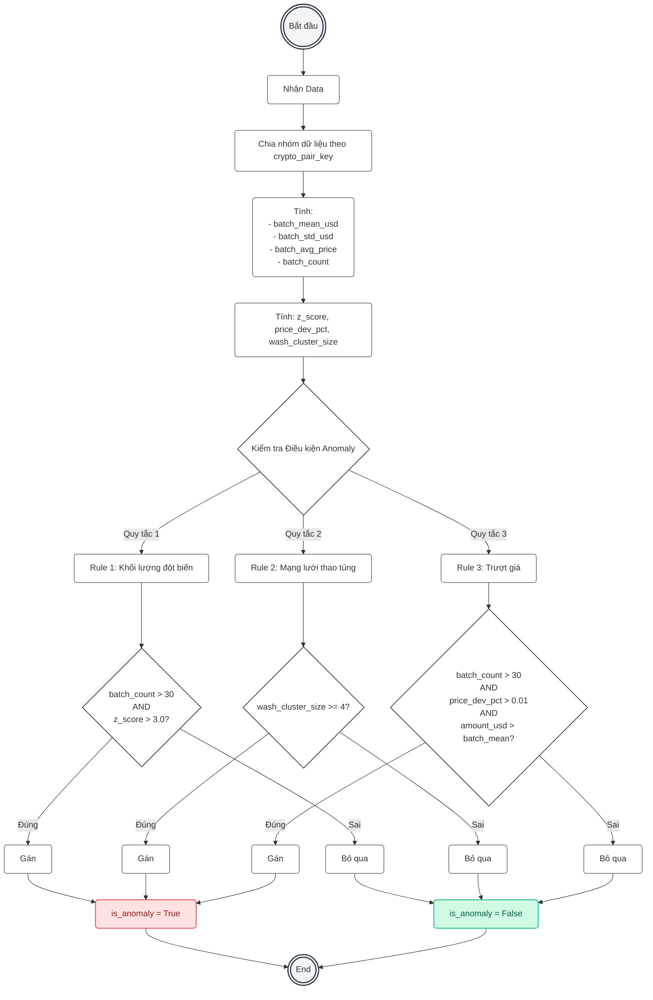

# Phân Tích Chuyên Sâu Source Code: Kafka Data Ingestion Pipeline

Tài liệu này cung cấp bản "mổ xẻ" cực kỳ chi tiết đến từng dòng code, nguyên lý cấu hình và lý do tại sao các quyết định thiết kế (Design Decisions) lại được chọn trong hai file `live_producer.py` và `spark_processor.py`. Rất hữu ích cho việc bảo vệ khóa luận (KLTN).

---

## 1. Mổ xẻ `producer/live_producer.py` (Ingestion Layer)

Tệp này có một nhiệm vụ duy nhất: **Bắt luồng dữ liệu từ Binance và đẩy vào Kafka càng nhanh càng tốt.** Nó tuân thủ nguyên tắc *Single Responsibility Principle* (Đơn nhiệm) - không làm sạch, không đổi kiểu dữ liệu, chỉ vận chuyển.

### 1.1 Khởi tạo & Các thông số quan trọng
```python
16: import json, os, sys, time
20: from datetime import datetime
22: from dotenv import load_dotenv
23: from kafka import KafkaProducer
24: from kafka.errors import NoBrokersAvailable
25: import websocket
```
- **Tại sao dùng `websocket` thay vì API thường (REST)?** REST API bắt buộc bạn phải liên tục gửi request (Polling) để hỏi "có giao dịch mới không", điều này tốn tài nguyên và bị giới hạn rate-limit (Binance sẽ ban IP). `websocket` mở một đường hầm hai chiều duy trì liên tục, khi có giao dịch mới Binance tự động đẩy (push) về máy ta theo thời gian thực (độ trễ ms).

```python
30: KAFKA_BOOTSTRAP_SERVERS = os.getenv("KAFKA_BOOTSTRAP_SERVERS", "localhost:9092")
31: KAFKA_TOPIC = os.getenv("KAFKA_TOPIC", "payment_events_v3")
```
- `KAFKA_BOOTSTRAP_SERVERS`: Cổng giao tiếp mặc định của Kafka broker.
- `KAFKA_TOPIC`: Nơi dữ liệu sẽ được lưu trữ tạm thời trước khi Spark lấy đi. Kafka giống như một ống nước lớn, Topic là một làn đường trong ống nước đó.

```python
41: BINANCE_WS_URL = (
42:     "wss://stream.binance.com:9443/stream?streams="
43:     + "/".join(f"{s}@trade" for s in SYMBOLS)
44: )
```
- **Cú pháp Multi-stream của Binance:** Thay vì mở 5 kết nối websocket cho 5 đồng coin, Binance cho phép nối tên các luồng lại bằng dấu `/` (ví dụ: `btcusdt@trade/ethusdt@trade`). `@trade` nghĩa là ta chỉ quan tâm đến các khớp lệnh mua bán thành công, không quan tâm đến sổ lệnh (orderbook).

### 1.2 Hàm `create_kafka_producer()`
```python
53:             producer = KafkaProducer(
54:                 bootstrap_servers=KAFKA_BOOTSTRAP_SERVERS,
55:                 value_serializer=lambda v: json.dumps(v, ensure_ascii=False).encode("utf-8"),
56:                 acks=1,
57:                 retries=3,
58:                 compression_type="lz4",
59:             )
```
- `value_serializer`: Chuyển đổi dữ liệu Python Dictionary thành chuỗi JSON (dạng bytes) trước khi gửi vào Kafka. `ensure_ascii=False` để giữ nguyên các ký tự đặc biệt.
- **`acks=1`**: Cấu hình quan trọng. Chỉ yêu cầu Kafka Leader xác nhận đã nhận được tin nhắn là coi như gửi thành công, không đợi các bản sao (Replicas) xác nhận. Phù hợp cho streaming tốc độ cao.
- **`compression_type="lz4"`**: Nén dữ liệu theo thuật toán LZ4. LZ4 nén cực nhanh, tiết kiệm băng thông mạng và dung lượng đĩa cho Kafka mà không làm tăng độ trễ (latency).

### 1.3 Logic trong hàm `on_message`
Đây là hàm thực thi hàng nghìn lần mỗi giây khi có trade.
```python
112:             data = json.loads(message)
115:             if "data" in data:
116:                 trade = data["data"]
```
- Khi dùng multi-stream, Binance sẽ bọc dữ liệu bên trong thẻ `"data"`.
```python
129:             raw_payload = {
130:                 "trade_id":        trade.get("t"),       # Binance original trade ID
131:                 "crypto_symbol":   trade.get("s"),       # Symbol (e.g. BTCUSDT)
132:                 "price":           trade.get("p"),       # Price as STRING from Binance
133:                 "quantity":        trade.get("q"),       # Quantity as STRING from Binance
...
141:             producer.send(KAFKA_TOPIC, value=raw_payload)
```
- **Data Mapping:** Binance trả về key rất ngắn gọn (t=trade ID, s=symbol, p=price) để tiết kiệm băng thông. Ta map lại thành tên có nghĩa (`trade_id`, `crypto_symbol`) để dễ đọc ở các bước sau.
- **Lưu ý cực kỳ quan trọng:** Ở dòng 132-133, `price` và `quantity` do Binance trả về đều ở định dạng **String** (Chuỗi). Ta KHÔNG ép kiểu thành float ở đây, vì việc ép kiểu hàng nghìn lần/s bằng Python thuần sẽ gây nút thắt cổ chai (bottleneck). Ta đẩy luôn chuỗi vào Kafka để hệ thống Spark (chạy bằng C++/Scala bên dưới) ép kiểu sau.

---

## 2. Mổ xẻ `processor/spark_processor.py` (Processing Layer)

Đây là "Trái tim" của hệ thống. Nhận dữ liệu thô từ Kafka -> Xử lý (Spark Streaming) -> Lưu vào PostgreSQL (Primary) & BigQuery (Backup).

### 2.1 Cấu hình Spark Session siêu tốc (Dòng 102 - 139)
```python
122:         .config("spark.sql.shuffle.partitions", "2")
126:         .config("spark.sql.execution.arrow.pyspark.enabled", "true")
129:         .config("spark.sql.streaming.noDataMicroBatches.enabled", "false")
133:         .config("spark.sql.adaptive.enabled", "true")
```
- `shuffle.partitions="2"`: Cực kỳ quan trọng. Mặc định Spark chia dữ liệu thành 200 mảnh khi cần shuffle (sắp xếp lại). Với máy cá nhân hoặc luồng dữ liệu nhỏ, tạo 200 mảnh gây ra overhead cực lớn. Giảm xuống 2 giúp CPU chạy mượt hơn.
- `arrow.pyspark.enabled`: Bật Apache Arrow. Giúp việc chuyển đổi dữ liệu giữa nhân JVM (Java của Spark) và Python nhanh hơn gấp chục lần (Zero-copy serialization).
- `noDataMicroBatches.enabled="false"`: Nếu không có dữ liệu mới từ Kafka, Spark sẽ ngủ thay vì cố gắng xử lý một lô (batch) rỗng, tiết kiệm CPU.

### 2.2 Hàm `process_raw_to_fact` (Bảy bước luyện đan)
Hàm này biến dataframe thô thành fact table chuẩn Kimball.

**Bước 1: Type Casting (Dòng 164 - 172)**
```python
166:         .withColumn("price",    col("price").cast("double"))
170:             "trade_time", expr("to_timestamp(trade_time_ms / 1000)")
```
- Ép `price`, `quantity` sang kiểu số thực đôi (`double`). 
- Chia thời gian mili-giây cho 1000 để thành kiểu `timestamp` chuẩn của SQL.

**Bước 2: Cleansing (Dòng 183 - 190)**
```python
186:         .filter(col("crypto_symbol").isNotNull() & (col("crypto_symbol") != ""))
187:         .filter(col("price").isNotNull() & (col("price") > 0))
```
- Loại bỏ các gói tin rác (vd lỗi mạng làm giá bị < 0, hoặc thiếu symbol).

**Bước 3: Deduplication (Khử trùng lặp đa tầng) (Dòng 221 - 234)**
- *Tại sao bị trùng lặp?* Do tính chất "At-least-once" của Kafka, hoặc Binance rớt mạng rồi gửi lại cùng một gói tin.
```python
224:             "transaction_id",
225:             concat_ws("_", col("crypto_symbol"), col("trade_id").cast("string"))
232:         .withWatermark("trade_time", "30 seconds")
233:         .dropDuplicates(["transaction_id"])
```
- **Tạo ID Định danh:** Ghép Symbol và Trade_ID lại (VD: `BTCUSDT_456789`).
- **Watermarking:** Kỹ thuật cực hay của Spark Streaming. Nó nói với Spark rằng: "Hãy nhớ cái ID này trong bộ nhớ RAM trong đúng 30 giây. Nếu 30 giây tới có thằng nào ID y chang thì xóa bỏ. Quá 30 giây thì hãy quên nó đi để giải phóng RAM".

**Bước 4 & 5: Business Logic (Tính USD & Phân loại)**
```python
260:         when(col("amount_usd") >= 1_000_000, lit(4))   # WHALE
```
- Chia các trade thành 4 mức độ: Nhỏ lẻ (Retail), Chuyên nghiệp, Tổ chức, Cá mập (Whale). Sử dụng surrogate key (1,2,3,4) thay vì lưu chuỗi chữ "WHALE" giúp CSDL PostgreSQL và BigQuery giảm được cực kỳ nhiều dung lượng đĩa.

**Bước 7: Sinh khóa ngoại (Surrogate Keys) (Dòng 301 - 315)**
```python
307:         .withColumn("date_key", date_format(col("trade_time"), "yyyyMMdd").cast("long"))
311:         .withColumn("crypto_pair_key", crypto_sk_map[col("crypto_symbol")].cast("int"))
```
- Thay vì lưu timestamp đầy đủ "2024-04-14 15:30:00", ta sinh ra `date_key = 20240414` để sau này JOIN vào bảng `dim_date` cực kì nhanh. Đây là chuẩn **Star Schema (Kimball)**.

### 2.3 Phân Tích Logic Anomaly Detection (Phát hiện gian lận/bất thường)
Diễn ra trong hàm `dual_sink_batch` (Dòng 564 - 595).
Tại sao lại viết ở đây? Vì thuật toán Z-Score cần tính mức trung bình (`avg`) của lô dữ liệu. Spark Streaming KHÔNG cho phép tính `avg` liên tục theo cửa sổ động trừ khi ở chế độ batch tĩnh. Lệnh `.foreachBatch` tách dòng suối thời gian thực thành các "khối" tĩnh để ta phân tích.

```python
567:         w_symbol = Window.partitionBy("crypto_pair_key")
574:             .withColumn("batch_mean_usd", avg("amount_usd").over(w_symbol))
577:             .withColumn("z_score", (col("amount_usd") - col("batch_mean_usd")) / col("batch_std_usd"))
```
- Lệnh này Gom nhóm tất cả giao dịch trong 200ms qua theo từng cặp tiền (Window).
- Lấy `amount_usd` trừ đi `batch_mean` rồi chia cho độ lệch chuẩn `batch_std`. Nếu `z_score > 3.0` (quy tắc 3-Sigma), giao dịch này lớn một cách bất thường so với phần còn lại của thị trường tại giây phút đó.

```python
584:             .withColumn("wash_cluster_size", count("trade_id").over(w_wash))
```
- **Wash trade** là hành vi tự mua tự bán liên tục cùng 1 giá cùng 1 giây để thao túng khối lượng. Lệnh này đếm số lượng giao dịch diễn ra trên cùng 1 đồng coin tại exacly cùng 1 mili-giây. Nếu > 4, đánh dấu là Wash Trade.

#### Sơ đồ luồng logic Phát hiện Bất thường (Anomaly Detection Flowchart)



### 2.4 Chiến lược Dual Sink (Lưu đa luồng) & DLQ (Dòng 340 - 547)

**PostgreSQL (Hệ thống tức thời):**
```python
402:                 ON CONFLICT (transaction_id) DO UPDATE SET
403:                     price = EXCLUDED.price, ...
```
- Lệnh UPSERT. Đây là hàng rào phòng ngự số 2 chống trùng lặp. Nếu Spark quên mất giao dịch (sau khi xả watermark 30 giây), DB Postgres sẽ chặn lại bằng ràng buộc UNIQUE `transaction_id` và chỉ Cập Nhật lại, giúp bảo vệ tính vẹn toàn (Integrity).
- Sử dụng `SimpleConnectionPool` (Dòng 356) giúp tăng tốc độ insert từ 100ms lên vài ms bằng cách không phải mở/đóng kết nối database liên tục.

**BigQuery & DLQ (Hệ thống dự phòng Async):**
- BigQuery lưu trữ dạng Data Warehouse cho báo cáo PowerBI. Tuy nhiên nếu đẩy lên mỗi 200ms thì Google sẽ chém tiền rate-limit.
```python
620:             if current_buffer_size >= BQ_UPLOAD_ROWS_LIMIT or time_since_last_upload >= BQ_UPLOAD_INTERVAL_SEC:
```
- Buffer: Gom đủ 5000 records hoặc đợi 10 giây mới đẩy 1 lần.
```python
523:         except Exception as e:
...
532:                 shutil.move(pq_path, dlq_path)
```
- **DLQ (Dead-Letter Queue):** Nếu upload lên GCP thất bại (mất mạng, hết quota...), khối lượng dữ liệu khổng lồ này sẽ không bị ném đi. Hệ thống lưu thành file Parquet cục bộ trong thư mục `dlq_bq_failed` để ta upload thủ công bù lại lúc mạng ổn định.

### 2.5 Engine Khởi động (Dòng 702 - 709)
```python
702:     query = (
703:         fact_df.writeStream
704:         .outputMode("append")
705:         .foreachBatch(dual_sink_batch)
706:         .trigger(processingTime=TRIGGER_INTERVAL)
707:         .option("checkpointLocation", "/tmp/spark_checkpoint_binance_v7")
708:         .start()
709:     )
```
- `outputMode("append")`: Chỉ đẩy những bản ghi hoàn toàn mới.
- `checkpointLocation`: Tính năng Fault-Tolerance cực mạnh. Spark liên tục ghi lại vị trí offset (dấu trang) mà nó đã đọc từ Kafka ra đĩa cứng. Nếu server cúp điện cái rụp, khi mở lên, Spark sẽ đọc checkpoint này và bắt đầu đọc từ dòng Kafka tiếp theo, **không bao giờ có chuyện mất mát hoặc phân tích lặp giao dịch**.
